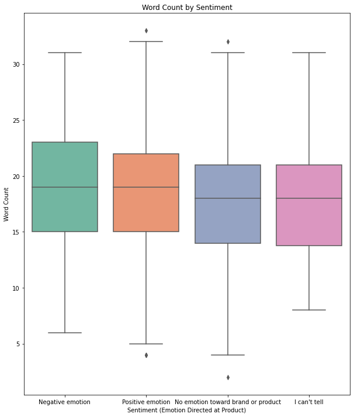
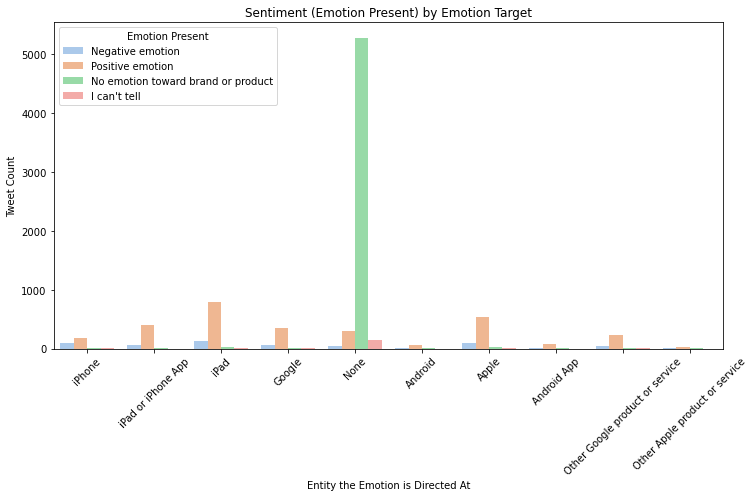

# PROJECT OVERVIEW
This project focuses on building a machine learning model to classify the sentiment expressed in tweets about products or brands, using Natural Language Processing (NLP) techniques. The task is defined as a binary classification problem, where the model determines whether a tweet contains an emotion directed at a brand or product ("Yes") or not ("No"). The project uses a dataset of labeled tweets (tweet_product_company.csv) and involves text preprocessing, exploratory data analysis (EDA), handling class imbalance, feature engineering, and preparing data for model training. The final model will enable automated monitoring of customer sentiment on social media platforms, providing valuable insights for businesses.

# BUSINESS UNDERSTANDING
In today’s digital age, social media platforms like Twitter (now X) are critical channels for customers to express opinions about products and brands. Understanding customer sentiment in real-time can help companies gauge brand perception, identify customer pain points, and tailor marketing strategies. However, manually analyzing thousands of tweets is impractical. This project addresses this challenge by developing an automated sentiment classification model that identifies whether tweets express emotions toward products or brands. The solution can be used by businesses for brand monitoring, customer feedback analysis, and improving product offerings based on public sentiment.

# PROBLEM STATEMENT
Businesses face the challenge of efficiently analyzing large volumes of tweets to determine whether they contain emotions directed at their products or brands. The dataset (tweet_product_company.csv) consists of 9,093 tweets, each with text content, a column indicating the target of any emotion (e.g., iPhone, iPad, Google, or "None" for missing values), and a label categorizing the sentiment as "Positive emotion," "Negative emotion," "No emotion toward brand or product," or "I can't tell." A significant issue is the class imbalance, with 59.2% of tweets labeled as "No emotion toward brand or product," 32.7% as "Positive emotion," 6.3% as "Negative emotion," and 1.7% as "I can't tell," which complicates accurate classification. Additionally, the dataset contains noise such as URLs, mentions, and punctuation, and the emotion_in_tweet_is_directed_at column has 5,802 missing values, making it challenging to leverage this feature effectively. The presence of duplicate tweets (22 instances) and one missing tweet_text entry further complicates data quality. The primary problem is to accurately classify whether a tweet expresses an emotion directed at a brand or product based solely on its text content, amidst these challenges of class imbalance, noisy text data, and incomplete metadata.

# OBJECTIVES
1. To build a machine learning model that can classify whether a tweet contains an emotion directed at a brand or product, using only the tweet text.

2. To clean and preprocess tweet data by converting text to lowercase, removing punctuation, URLs, and mentions, and tokenizing for feature extraction.

3. To explore and analyze the dataset through visualizations that reveal key patterns such as tweet length, emotional targets, and class imbalance.

4. To address class imbalance in the dataset and improve model performance using resampling techniques or appropriate evaluation metrics.

# DATA UNDERSTANDING AND ANALYSIS

**1. Dataset Description**

Source: Data/tweet_product_company.csv

Columns:

tweet_text: The raw text of the tweet (e.g., ".@wesley83 I have a 3G iPhone. After 3 hrs tweeting...").

emotion_in_tweet_is_directed_at: The product or brand targeted by the emotion (e.g., iPhone, iPad, Google; 5,802 missing values filled with "None").

is_there_an_emotion_directed_at_a_brand_or_product: The target variable with four categories: "Positive emotion," "Negative emotion," "No emotion toward brand or product," and "I can't tell."

Size: 9,093 rows initially, reduced to 9,065 after removing 1 row with missing tweet_text and 22 duplicates based on tweet_text.

Class Distribution (before balancing):

No emotion toward brand or product: 5,372 (59.2%)

Positive emotion: 2,968 (32.7%)

Negative emotion: 569 (6.3%)

I can't tell: 156 (1.7%)

**Key Observations:**

The dataset has a significant class imbalance, with "No emotion" being the majority class.

The emotion_in_tweet_is_directed_at column has substantial missing data, limiting its use unless imputed or selectively utilized.

Tweets vary in length, which may influence sentiment expression.

**2. Data Cleaning**

Missing Values:

Dropped 1 row with missing tweet_text as it’s critical for modeling.

Filled missing emotion_in_tweet_is_directed_at with "None."

Duplicates: Removed 22 duplicate rows based on tweet_text.

Text Preprocessing:

Created clean_text column by converting text to lowercase, removing URLs, @mentions, punctuation, and extra whitespace.

Added tokens column by splitting clean_text into words for feature extraction.

Output: A cleaned dataset with new columns (clean_text, tokens) saved as Data/Cleaned_Tweet.csv.

# ANALYSIS

1. Tweet Length Distribution 

Most tweets are between 50–150 characters, suggesting tweets are short-form.

2. Word Count Distribution

Tweets have 5 to 20 words on average.

3. Tweet Length vs Sentiment (Target)

Tweets marked with emotion (Yes) are generally longer.

4. Word Count vs Sentiment

Emotional tweets tend to have more words, suggesting wordiness correlates with sentiment.

5. Emotion Target vs Sentiment

Some entities like 'Apple', 'iPad', and 'Google' receive a significantly higher number of emotionally-labeled tweets compared to others.

6. Tweet Length by Sentiment and Emotion Target

Longer emotional tweets may be more prevalent for certain brands.

7. Correlation Between Length and Word Count (Numerical Features)

Expect very high correlation (~0.9).

# Feature Engineering

This section focuses on transforming the raw tweet text into a form suitable for machine learning models.

#### Sentiment Simplification
- The original `sentiment` labels were filtered to three categories:
  - Positive emotion
  - Negative emotion
  - No emotion
- Tweets labelled as "I can't tell" were excluded due to ambiguity and minimal representation.

#### Stopword Removal and Lemmatisation
- English stopwords were removed to reduce noise.
- Tokens were stemmed using `PorterStemmer` to standardise word forms (e.g., "running" → "run").

#### Feature Construction
- A new `tokens` column was added to the dataset to store the cleaned and processed word lists.
- This column formed the basis for vectorisation in the modelling phase.

#### TF-IDF Vectorisation Pipeline
- A `TfidfVectorizer` was applied to the tokenised text:
  - Included unigrams and bigrams.
  - Limited the vocabulary size to the top 10,000 features using the `max_features` parameter.

  - Upon calculating the mutual information score for this n-grams, using `mutual_info_classif`, found bigrams weren't impactful for sentiment classification
  - Set the final vectoriser to only include unigrams and select the top 10,000 features
- This vectorisation step was encapsulated within a pipeline for ease of reuse during model training.

The final output of this section was a cleaned and vectorised dataset, ready for modelling.

#MODELLING.

We chose the XGBoost model for sentiment classification due to its strong and balanced performance across both classes. After performing a comprehensive hyperparameter tuning using GridSearchCV with 5-fold cross-validation over 72 parameter combinations, the model achieved an overall accuracy of 92% on the test set.

More importantly, the f1-scores for both classes were high and balanced:

    Class 0 (Negative): f1-score = 0.92

    Class 1 (Positive): f1-score = 0.92

    Macro Avg f1-score: 0.92

This indicates that the model is neither biased toward a single class nor overfitting, and handles class distinctions well. These results demonstrate that XGBoost is both accurate and reliable, making it a strong choice for this sentiment classification task.

#CONCLUSION.

In this project, we successfully built a sentiment classification pipeline for tweets related to products and brands using Natural Language Processing (NLP) techniques. Starting from raw, noisy social media data, we performed comprehensive data cleaning, exploratory data analysis (EDA), class balancing, and text preprocessing, including stopword removal and stemming.

The best-performing model will be selected for saving and future deployment, where it can be used to automatically analyze incoming tweets in real time. This solution enables businesses to monitor customer sentiment about their products on social media platforms, offering actionable insights for marketing, product development, and customer service strategies.

Overall, the project demonstrates the practical power of NLP and machine learning in solving real-world problems related to brand percept.

Future Work
Model Deployment (Planned)
Package the best-performing model and deploy it as an API using FastAPI, allowing real-time tweet sentiment predictions.

Use Deep Learning Models
Explore advanced models like LSTM or transformers (e.g., BERT) to potentially improve classification performance, especially on complex or nuanced tweets.

Expand the Dataset
Collect or integrate more labeled tweets to improve generalization and robustness, especially for underrepresented sentiment classes.
Aspect-Based Sentiment Analysis
Move beyond overall sentiment and analyze which specific product or brand feature the sentiment is directed toward.

